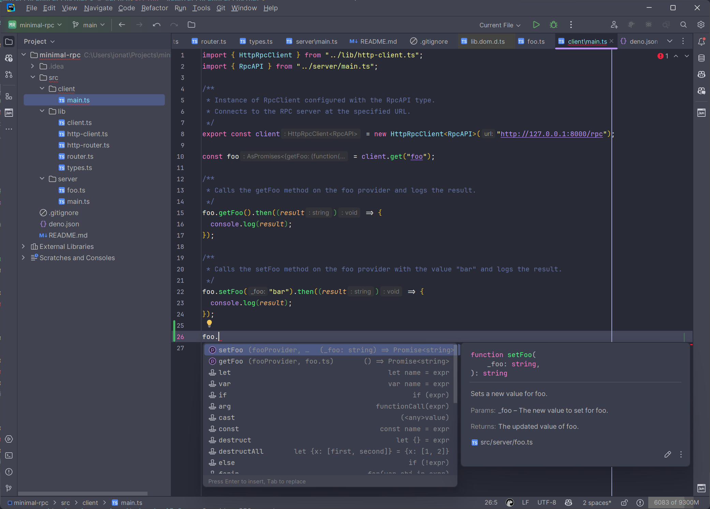

# Lightweight Typescript RPC Example

This project provides an example of how to do RPC without depending on full
frameworks like TRPC, but keeping full type safety and minimal overhead.

It allows you to define remote procedure calls (RPC) with TypeScript, ensuring
type safety across the client and server.



## Features

- **Full Type Safety**: Ensures that the types of your RPC methods are
  consistent between the client and server.
- **Minimal Overhead**: Lightweight and easy to integrate into existing
  projects.
- **Simple API**: Easy to define and use remote procedures.

## Getting Started

### Prerequisites

This example uses Deno, but the RPC example can be used with any runtime and web
framework.

### Defining Remote Procedures

Create a file for the server to expose some functions, see
[src/server/foo.ts](src/server/foo.ts)

```ts
// src/server/foo.ts

/**
 * A string variable representing the value of foo.
 */
let foo = "Foo";

/**
 * Gets the current value of foo.
 * @returns {string} The current value of foo.
 */
function getFoo(): string {
  console.log("Invoked Get Foo");
  return foo;
}

/**
 * Sets a new value for foo.
 * @param {string} _foo - The new value to set for foo.
 * @returns {string} The updated value of foo.
 */
function setFoo(_foo: string): string {
  console.log(`Invoked Set Foo with ${_foo}`);
  foo = _foo;
  return foo;
}

/**
 * An object that provides procedures to get and set the value of foo.
 */
export const fooProvider = { getFoo, setFoo };

```

### Setting Up the Server

Create a file to instantiate the RPC router and server and wire in the RPCs, see
[src/server/main.ts](src/server/main.ts)

```ts
// src/server/main.ts

import { HttpRpcRouter } from "../lib/http-router.ts";
import { fooProvider } from "./foo.ts";

/**
 * Type representing the RPC API, which includes the foo provider.
 */
export type RpcAPI = {
  foo: typeof fooProvider;
};

/**
 * Instance of RpcRouter configured with the RpcAPI type.
 */
export const router = new HttpRpcRouter<RpcAPI>({
  foo: fooProvider,
});

/**
 * Starts the Deno server and handles incoming requests.
 * Routes POST requests to /rpc to the RpcRouter instance.
 * Returns a 404 response for all other requests.
 */
Deno.serve((req) => {
  const url = new URL(req.url);

  if (req.method === "POST" && url.pathname === "/rpc") {
    return router.handle(req);
  }

  return new Response("Not Found", { status: 404 });
});
```

### Setting Up the Client

Create a file that will be used by the client and call the client.get to get a
proxy object [main.ts](src/client/main.ts)

> NOTE: The proxy object is a client side type safe object that will call the
> server side methods using the transport defined by the RpcClient impl.

```ts
// src/client/main.ts

import { HttpRpcClient } from "../lib/http-client.ts";
import type { RpcAPI } from "../server/main.ts"; // Important to only use `import type` here to avoid pulling in the actual implementation and possible server-side code

/**
 * Instance of RpcClient configured with the RpcAPI type.
 * Connects to the RPC server at the specified URL.
 */
export const client = new HttpRpcClient<RpcAPI>("http://127.0.0.1:8000/rpc");

/**
 * Proxy object for the foo provider on the RPC server.
 * Provides type-safe access to the procedures of the foo provider.
 */
const foo = client.get("foo");

/**
 * Call the getFoo procedure on the foo provider and log the result.
 * This has the exact same signature as the getFoo procedure on the server and all the same Intellisense support.
 */
console.log("Calling getFoo procedure on foo provider...");
foo.getFoo().then((result) => {
  console.log(`Result of getFoo: ${result}`);
});

/**
 * Call the setFoo procedure on the foo provider and log the result.
 * This has the exact same signature as the setFoo procedure on the server and all the same Intellisense support.
 */
console.log("Calling setFoo procedure on foo provider...");
foo.setFoo("bar").then((result) => {
  console.log(`Result of setFoo: ${result}`);
});

```

## Usage

### Running the Server

Start the example Deno server by running the following command:

```shell
deno run --allow-net src/server/main.ts
```

Test the client by running the following command:

```shell
deno run --allow-net src/client/main.ts
```

### Using Curl

You can also make RPC calls using `curl`:

From there you can fill in the gaps with exposing endpoints arg schemas
generated by zod etc to make it more user friendly and consumable.

You can use the schemas in the RPC functions as you would do with any
application boundary i.e. DBs, Message Queues etc to ensure that the data is
valid and safe.

```shell
curl --location 'http://127.0.0.1:8000/rpc' \
--header 'Content-Type: application/json' \
--data '{
    "provider": "foo",
    "method": "getFoo",
    "args": []
}'
```

### Making RPC Calls

You can make RPC calls using the client as shown in `src/client/main.ts`. For
example, to get and set the value of `foo`:

```ts
foo.getFoo().then((result) => {
  console.log(result);
});

foo.setFoo("bar").then((result) => {
  console.log(result);
});
```

## Extending the Client and Router for other Transports

To create new transports, you need to extend the `RpcClient` and `RpcRouter`
classes to handle the desired transport mechanism. For example, if you want to
use WebSockets instead of HTTP, you would create `WebSocketRpcClient` and
`WebSocketRpcRouter` classes. These classes should implement the `handle` method
to send and receive RPC requests and responses using WebSockets. By following
this approach, you can easily adapt the framework to use different transport
layers while maintaining full type safety and minimal overhead. This
extensibility allows the framework to be used in various environments and
applications, such as local networks or inter-process communication (IPC).

### Router Example

[http-router.ts](src/lib/http-router.ts)

### Client Example

[http-client.ts](src/lib/http-client.ts)

## Conclusion

This is just a simple demonstration as reference for a lightweight RPC which
provides a simple and efficient way to define and use remote procedures with
full type safety.

> You really should not be using this for the standard Web as any RPC style
> framework breaks most of the principles of the Web and makes caching,
> security, and debugging much harder.

However, for other applications that would use RPC in predictable environments
like local networks or IPC this is an extensible and simple way to do RPC with
full type safety.

## Notes

Update this README code snippets with the following:

```shell
npx embedme README.md
```
